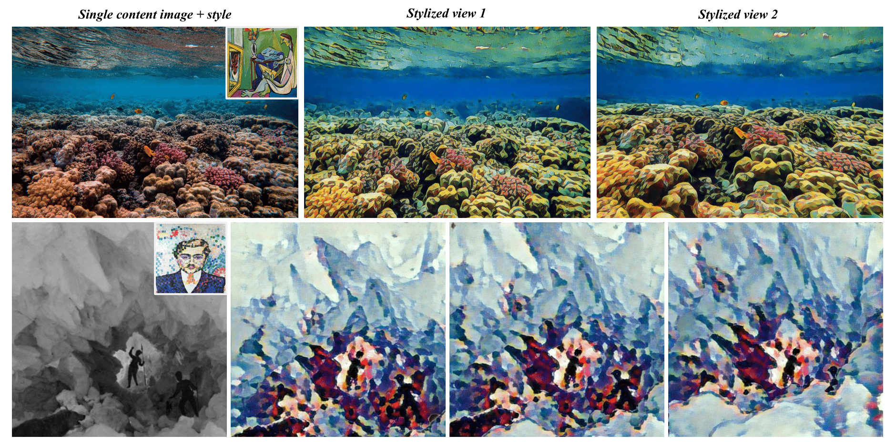
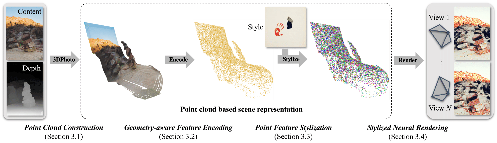

> ## 3D Photo Stylization: Learning to Generate Stylized Novel Views from a Single Image
> ### [Paper](https://arxiv.org/abs/2112.00169) | [Project Page](https://pages.cs.wisc.edu/~fmu/style3d/) | [Poster](https://pages.cs.wisc.edu/~fmu/style3d/poster.pdf) | [Video Demo](https://www.youtube.com/watch?v=GTE7QqeytGg&feature=youtu.be) <br>
> [Fangzhou Mu](https://pages.cs.wisc.edu/~fmu/)<sup>1</sup>,[Jian Wang](https://jianwang-cmu.github.io/) <sup>2#</sup>, [Yicheng Wu](https://yichengwu.github.io/)<sup>2#</sup>, [Yin Li](https://www.biostat.wisc.edu/~yli/)<sup>1#</sup> <br>
> <sup>1</sup>University of Wisconsin-Madison, <sup>2</sup>Snap Research<br>
> (<sup>#</sup>co-corresponding authors)<br>
> **CVPR 2022 (Oral)**<br>

<p align="center">
  
</p>

## Overview

This is the official PyTorch implementation of our method for 3D Photo Stylization. Our method takes a single content image and an arbitrary style image, and outputs high-quality stylized renderings that are consistent across views. Our implementation follows a multi-stage pipeline outlined below.

<p align="center">
  
</p>

- **Monocular depth estimation.** Given a content image, we apply any off-the-shelf model (such as [DPT](https://github.com/isl-org/MiDaS) and [LeReS](https://github.com/aim-uofa/AdelaiDepth)) for depth estimation. The output is a depth image and may optionally include the estimated camera field of view (FOV).

- **Point cloud construction.** We apply [3D Photo Inpainting](https://github.com/vt-vl-lab/3d-photo-inpainting) to convert the content image and its estimated depth into a layered depth image (LDI). We further back-project the LDI pixels to 3D given the estimated camera FOV, and transform the resulting point cloud into normalized device coordinates (NDC).

- **Point cloud encoding, stylization, rasterization and image decoding.** This is the core component of our method. We run a graph convolutional network (GCN) for feature extraction on the point cloud, apply an attention-based style transfer module inspired by [AdaAttN](https://github.com/Huage001/AdaAttN) for feature modulation, rasterize the featurized point cloud to novel views given camera pose and intrinsics, and decode the feature maps into stylized RGB images using a 2D neural renderer.

Note that our repository does not include third-party code for depth estimation and 3D photo inpainting. Please use the sample LDIs and style images in the `samples` folder to reproduce our results in the paper.

## Quick Start

### Preliminaries

- **Clone the repository**
```shell
git clone https://github.com/fmu2/3d_photo_stylization.git
cd 3d_photo_stylization
```

- **Set up the environment**
```shell
conda create -n 3d_photo_stylization python=3.7
conda activate 3d_photo_stylization
conda install -c pytorch pytorch==1.7.1 torchvision==0.8.2 cudatoolkit=11.0
conda install -c conda-forge tensorboard tensorboardx
conda install -c anaconda scipy pyyaml
conda install -c conda-forge ffmpeg imageio imageio-ffmpeg
```

- **(Optional) Install packages for point cloud visualization**
```shell
conda install -c conda-forge plyfile matplotlib
conda install -c open3d-admin open3d
```

- **Compile C++ and CUDA extension**
```shell
python setup_render.py build_ext --inplace
python setup_pointnet2.py build_ext --inplace
```

### Training
- **(TODO) Prepare datasets**

Download the pre-processed COCO2014 dataset [here](https://drive.google.com/drive/folders/1izrDR6QILW5n7eon1mAhN6r2RuSEmwYL?usp=sharing) and the WikiArt dataset [here](https://www.kaggle.com/c/painter-by-numbers). Unzip the files.
```shell
cd coco_pcd
tar -xvzf train.tar.gz
tar -xvzf val.tar.gz
cd ..
cd wikiart
tar -xvzf train.tar.gz
tar -xvzf val.tar.gz
cd ..
```

Images from the COCO2014 training split are resized to 448 x 448 and converted into LDIs following the aforementioned steps. Each LDI (equivalently 3D point cloud) contains approximately 300K points. We use 80K LDIs for training and the remaining for validation. The raw WikiArt images are extremely large. We down-sample them to 512 x 512 and keep the original training and validation splits.

- **Recommended folder structure**
```
3d_photo_stylization
│   README.md
│   ...    
│
└───data
│   └───coco_pcd/
│   │   └───train/
│   │   │   └───ldi/
│   │   │   │   └───ldi/
│   │   │   │   │   │   COCO_train2014_000000XXXXXX.mat
│   │   │   │   │   │   COCO_train2014_000000XXXXXX.mat
│   │   │   │   │   │   ...
│   │   └───val/
│   │   │   └───ldi/
│   │   │   │   └───ldi/
│   │   │   │   │   │   COCO_train2014_000000XXXXXX.mat
│   │   │   │   │   │   COCO_train2014_000000XXXXXX.mat
│   │   │   │   │   │   ...
│   └───wikiart/
│   │   └───train/
│   │   │   │   XXX.jpg
│   │   │   │   XXX.jpg
│   │   │   │   ...
│   │   └───val/
│   │   │   │   XXX.jpg
│   │   │   │   XXX.jpg
│   │   │   │   ...
└───configs
│   │   inpaint3d.yaml
│   │   stylize3d.yaml
│   │   │   │   ...
└───log
│   ...
```
- **Two-stage training**

First, train the encoder-decoder network for view synthesis.
```shell
python train_inpaint.py -d {data_path} -c configs/{file_name}.yaml -n {job_name} -g {gpu_id}
```
The latest model checkpoint `inpaint-last.pth` and the config file `inpaint-config.yaml` will be saved under `log/{job_name}`.

Next, freeze the encoder, train the style transfer module and fine-tune the decoder.
```shell
python train_stylize.py -d {data_path} -s {style_path} -c configs/{file_name}.yaml -n {job_name} -g {gpu_id}
```
*Make sure that the two training stages share the same job name.* The latest model checkpoint `stylize-last.pth` and the config file `stylize-config.yaml` will be saved under `log/{job_name}`.

### Pre-trained models

Our pretrained models can be found in the `ckpt` folder. Use `ckpt/inpaint.pth` for view synthesis (without stylization), and `ckpt/stylize.pth` for stylization. 

### Evaluation

-  **Novel view synthesis without stylization**

Our code supports rasterization of the input RGB point cloud without an encoder-decoder pass. This is similar to 3DPhoto except that we do not convert the point cloud into a mesh before rendering.
```shell
python test_ldi_render.py -n {job_name} -g {gpu_id} -ldi {ldi_path} -cam {cam_motion} -x {x_bounds} -y {y_bounds} -z {z_bounds} -f {num_frames}
```

The output video will be saved under `test/out/ldi_render/{job_name}_{cam_motion}`.

Alternatively, the encoder-decoder network is also capable of novel view synthesis (without stylization) when no style image is given. *This is mostly for diagnostic purpose and is not the intended usage of our model.*
```shell
python test_ldi_model.py -n {job_name} -g {gpu_id} -m {model_path} -ldi {ldi_path} -cam {cam_motion} -x {x_bound} -y {y_bound} -z {z_bound} -f {num_frames}
```

The output video will be saved at `test/out/ldi_model/{job_name}_{cam_motion}`.

- **Stylized novel view synthesis**

To synthesizes a stylized 3D photo, run
```shell
python test_ldi_model.py -n {job_name} -g {gpu_id} -ldi {ldi_path} -s {style_path} -ss {style_size} -cam {cam_motion} -x {x_bound} -y {y_bound} -z {z_bound} -f {num_frames} -ndc
```
The output video will be saved under `test/out/ldi_model/{job_name}_{style_name}_{cam_motion}`.

Importantly, re-scale the point cloud for better results. This can be accomplished using the `-pc` flag. For example, `-pc 2` works well for content images of size 1080x720.

### Point cloud visualization

To save an inpainted point cloud (without normalization), run
```shell
python test_ldi_pcd.py -n {job_name} -ldi {ldi_path}
```

To visualize an inpainted point cloud in NDC space, run
```shell
python test_ldi_pcd.py -n {job_name} -ldi {ldi_path} -plot -ds 10
```

The point cloud (in `.ply` format) and its NDC-space visualization (in `.png` format) will be saved under `test/out/ldi_pcd/{job_name}`.

### Extension for multi-view input

Our method readily supports stylized novel view synthesis given multiple input views. Following [StyleScene](https://github.com/hhsinping/stylescene), we provide selected input views, their associated camera poses and depth maps, and a pre-defined camera trajectory for each scene in the Tanks and Temples dataset.

To synthesize novel views without stylization, run
```shell
python mvs_render.py -n {job_name} -g {gpu_id} -d {data_path}
```

To synthesize stylized novel views, run
```shell
python test_mvs.py -n {job_name} -g {gpu_id} -m {model_path} -d {data_path} -s {style_path} -ss {style_size} -ndc
```

## Contact
[Fangzhou Mu](http://pages.cs.wisc.edu/~fmu/) (fmu2@wisc.edu)

## Related Code Repos

Our code relies heavily on the following repos:
* LeReS <https://github.com/aim-uofa/AdelaiDepth/tree/main/LeReS>
* 3d-photo-inpainting <https://github.com/vt-vl-lab/3d-photo-inpainting>
* Pointnet2.PyTorch <https://github.com/sshaoshuai/Pointnet2.PyTorch>

Our code is inspired by the following repos:
* 3d-ken-burns <https://github.com/sniklaus/3d-ken-burns>
* softmax-splatting <https://github.com/sniklaus/softmax-splatting>
* deep_gcns_torch <https://github.com/lightaime/deep_gcns_torch>
* pytorch-AdaIN <https://github.com/naoto0804/pytorch-AdaIN>
* LinearStyleTransfer <https://github.com/sunshineatnoon/LinearStyleTransfer>
* AdaAttN <https://github.com/Huage001/AdaAttN>
* partialconv <https://github.com/NVIDIA/partialconv>
* stylescene <https://github.com/hhsinping/stylescene>
* synsin <https://github.com/facebookresearch/synsin>

## Reference
```
@inproceedings{mu20223d,
  title={3D Photo Stylization: Learning to Generate Stylized Novel Views from a Single Image},
  author={Mu, Fangzhou and Wang, Jian and Wu, Yicheng and Li, Yin},
  booktitle={Proceedings of the IEEE/CVF Conference on Computer Vision and Pattern Recognition},
  pages={16273--16282},
  year={2022}
}
```
